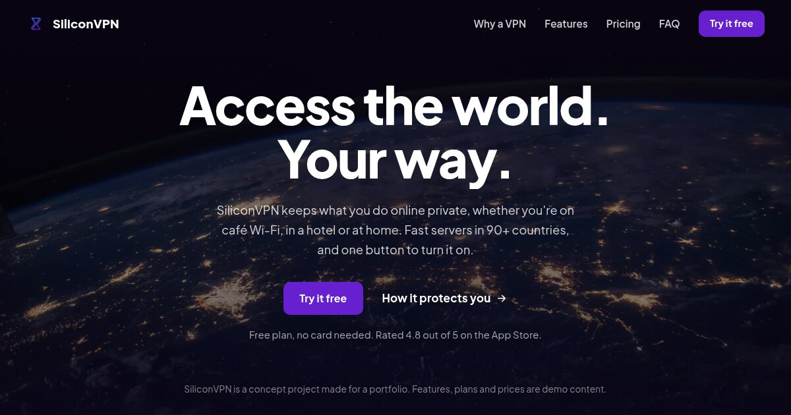

<div align="center">


# SiliconVPN

### Access the world. Your way.

[](https://madebymyst.github.io/silicon-vpn/)

</div>

> **This is a concept project.** SiliconVPN isn't a real VPN service. The features, plans and prices are demo content, made to show landing page design.



A landing page for a made-up privacy app, designed and built by [MadeByMyst](https://madebymyst.github.io/). It has one job: explain the product quickly and get visitors to pick a plan.

## What's on the page

- **Hero:** a full-screen, centred headline over a photo of the Earth at night
- **Why a VPN:** a plain explanation of what public Wi-Fi exposes, with and without a VPN
- **What you get:** six features, in plain text
- **How it works:** three steps
- **A word from a customer**
- **Pricing:** three plans, with yearly prices noted
- **FAQ** with smooth open and close, and a short closing call to action

## Simple and fast on purpose

- Plain HTML, CSS and JavaScript. No frameworks, no build step.
- Real photos instead of decoration, stored as WebP and sized for the page.
- Works on phones, tablets and desktops, and respects "reduce motion" settings.
- Motion is quiet: the headline slides in, sections fade up, the photo drifts as you scroll.

## Files

| File | What it does |
|---|---|
| `index.html` | The page |
| `styles.css` | Design tokens at the top, then each section, written mobile-first |
| `script.js` | Mobile menu, gentle scroll effects, the FAQ and the note on plan buttons |

To run it locally, open `index.html` in a browser, or serve the folder:

```bash
python3 -m http.server
```

## Credits

| Asset | Source |
|---|---|
| Earth at night | Photo by [NASA](https://unsplash.com/@nasa) on [Unsplash](https://unsplash.com/) |
| Laptop photo | [Unsplash](https://unsplash.com/) |
| Font | Plus Jakarta Sans from [Google Fonts](https://fonts.google.com/) |

---

<div align="center">

Made by **[MadeByMyst (Shahab MD)](https://madebymyst.github.io/)**, front-end developer based in Oman.

[](https://www.instagram.com/_mystiqdev72/)
[](https://www.linkedin.com/in/mystique-x-9572b93a7/)

</div>
